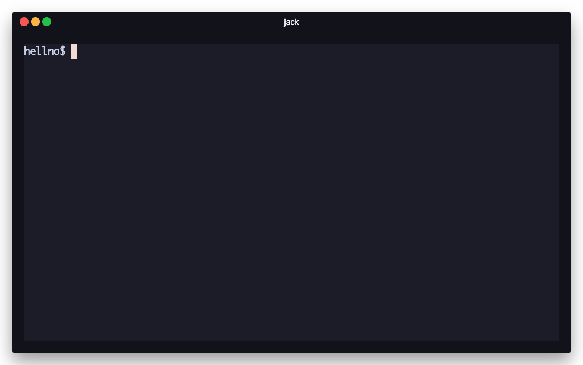

<p align="center">
  <h1 align="center">jack</h1>
  <p align="center"><strong>Ship before you forget why you started.</strong></p>
</p>

<p align="center">
  <a href="https://www.npmjs.com/package/@getjack/jack"></a>
  <a href="https://github.com/getjack-org/jack/blob/main/LICENSE"></a>
  <a href="https://docs.getjack.org"></a>
</p>

---

<p align="center">
  
</p>

---

You're vibecoding. Ideas are flowing. You want to ship.

But first: config files, deployment setup, secret management, debugging infrastructure errors...

**30 minutes later, the spark is gone.**

jack removes the friction between your idea and a live URL.

```bash
bunx @getjack/jack new my-app   # → deployed. live. done.
```

That's it. Write code. Ship again with `jack ship`. Stay in flow.

---

## Why jack

**Instant deployment** — `jack new` creates AND deploys. You have a live URL before your first commit.

**Works with your agent** — Claude Code, Cursor, Codex, whatever. Every project includes AI context files so your agent understands the stack from prompt one.

**Roaming secrets** — Configure once, use across all projects. No more per-project secret ceremony.

**Project tracking** — 100 experiments scattered everywhere? `jack ls` finds them all.

**No lock-in** — Standard config files, standard TypeScript. Your projects work without jack installed.

---

## Quick Start

```bash
# One command to create and deploy
bunx @getjack/jack new my-app

# Or install globally
bun add -g @getjack/jack
jack new my-app
```

You'll need [Bun](https://bun.sh) and a Cloudflare account (free tier works).

---

## Commands

| Command | What it does |
|---------|--------------|
| `jack new <name>` | Create and deploy a new project |
| `jack ship` | Deploy current project |
| `jack ls` | Show all your projects |
| `jack open` | Open project in browser |

Full documentation at **[docs.getjack.org](https://docs.getjack.org)**

---

## Who This Is For

Builders who ship constantly. You spin up new projects all the time, and suddenly you have dozens scattered across your machine—each with its own env vars, secrets, and deploy setup you've already forgotten.

jack keeps you organized. One command to ship, one place to find everything, zero setup overhead. Stay creative, skip the ceremony.

---

## Philosophy

In Gibson's *Neuromancer*, "jacking in" means plugging directly into cyberspace. The body becomes irrelevant—you're pure thought in the matrix.

jack handles the infrastructure so you stay in creative flow. The boring parts disappear. You just build.

---

## License

Apache-2.0

<p align="center">
  <i>Every deployment friction point is a creative thought lost.</i>
</p>
